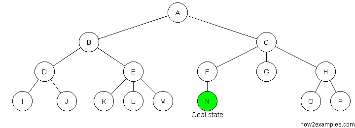

# Search Algorithms

## Linear Search
* Time Complexity = O(n)

Linear search involves looking through the entire array until the target element is found. An example of linear search is iterating through an array where the worst case scenario is when the element is at the end of the array.

```javascript
const linearSearch = (arr, target) => {
  for (let i = 0; i < arr.length; i++) {
    if (arr[i] === target) return i;
  }

  return null;
}
```

## Binary Search
* Time Complexity = O(log n)

Binary search involves determining where to look by comparing the target 

```javascript
const binarySearch = (arr, target) => {
  if (!arr.length) return null;

  const mid = Math.floor(arr.length / 2);

  if (arr[mid] === target) {
    return mid;
  } else if (arr[mid] > target) {
    return binarySearch(arr.slice(0, mid), target);
  } else {
    const foundIdx = binarySearch(arr.slice(mid + 1), target);
    return foundIdx !== null ? mid + foundIdx + 1 : null;
  }
};
```

## BFS (Breadth First Search)
* Time Complexity = O(n)

BFS uses a queue to traverse the tree in order by the tree level.



```javascript
const bfs = (root) => {
  const arr = [];
  const queue = [root];

  while (queue.length) {
    const currentNode = queue.shift();

    arr.push(currentNode.val);

    if (currentNode.left) queue.push(currentNode.left);
    if (currentNode.right) queue.push(currentNode.right);
  }

  return arr;
}
```

## DFS (Depth First Search)
* Time Complexity = O(n)

DFS uses a stack to traverse the tree from the lowest tree level to the highest. Since DFS uses stacks, recursion is optimal for implementation.


### PreOrder
```javascript
const dfs = (root, arr = []) => {
  if (!root) return;

  arr.push(root.val);
  predfs(root.left, arr);
  predfs(root.right, arr);
  
  return arr;
}
```


### InOrder
```javascript
const dfs = (root, arr = []) => {
  if (!root) return;

  predfs(root.left, arr);
  arr.push(root.val);
  predfs(root.right, arr);
  
  return arr;
}
```

### PostOrder
```javascript
const dfs = (root, arr = []) => {
  if (!root) return;

  predfs(root.left, arr);
  predfs(root.right, arr);
  arr.push(root.val);
  
  return arr;
}
```

## Dijkstra's Algorithm

