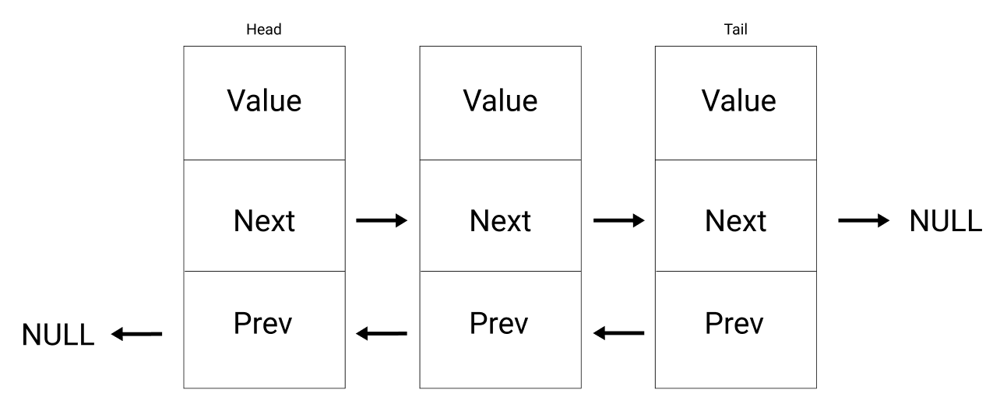

# Linked Lists
A linked list is a list of nodes where each node has a pointer to the next node in the sequence.\
The first node in the list is called the __Head__ and the last node in the list is called the __Tail__. The tail is defined as pointing to a ___null value___ signaling the end of the list.

<!-- 
## Why linked lists?
Compared to arrays, insertion and deletion in this data structure has a better time complexity. Arrays require the shifting of indices when an element is inserted or deleted causing these functions to be O(n).  -->

## Big O
* prepend (add to front of list) = __O(1)__
  * linked lists have a reference to their head node which can be easily reassigned
* append (add to back of list) = __O(1)__
  * linked lists also have a reference to their tail node which can be easily reassigned
* lookup = __O(n)__
  * you must traverse through the list to find the element at the specified index
* insert = __O(n)__
  * shares time complexity with lookup to insert a node at a specified index
* delete = __O(n)__
  * shares time complexity with lookup to remove the node at a specified index

## Singly vs Doubly
A node consists of two There are two types of linked lists, singly-linked and doubly-linked.
* Singly-linked lists are good for fast insertion and deletion with minimal searching/traversal.
* Doubly-linked lists are good when there is little limitation on memory and for easier searching.

### Singly-Linked Lists
Singly linked lists comprise of nodes that hold 2 pieces of information, __the value and a pointer to the next node__. Singly-linked lists _ONLY_ go in one direction, from the head to the tail.

#### Pros
* Simple implementation compared to doubly-linked lists
* Requires less memory (one less pointer for each node)
* Slightly faster due to less memory

#### Cons
* Can only traverse in one direction/Cannot traverse in reverse order

### Doubly-Linked Lists
Doubly linked lists comprise of nodes that hold an additional piece of information, __a pointer to the previous node__. Doubly-linked lists can be traversed from _BOTH_ directions. Because of this, the head of a doubly-linked list will have it's previous pointer pointing to null just like the tail has it's next pointer pointing to null.

#### Pros
* Can be traversed from both directions
* Deleting previous nodes are simpler

#### Cons
* More complex to implement correctly
* Requires more memory because of extra property

