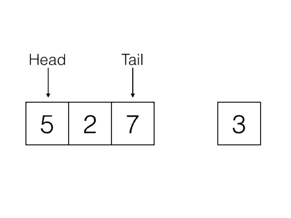
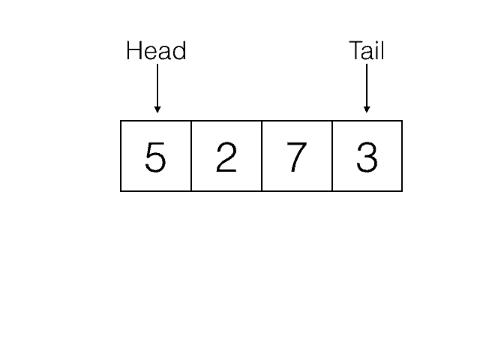

# Stacks
Stacks are a type of data structure which employs the Last In First Out (LIFO) principle. The last item to be added to the stack will be the first item removed. Stacks can be created using either arrays or linked lists.

### Last In First Out
#### Last In
\
#### First Out

## Big O

BOTH arrays and linked lists
* lookup = __O(n)__
* pop = __O(1)__
* push = __O(1)__
* peek = __O(1)__

# Queues
Queues, are like stacks but the main difference is that it employs the First In First Out (FIFO) principle. Queues can also be created using arrays and linked lists, however arrays are less efficient when it comes to 

### First In First Out
#### First In
\
####  First Out

## Big O

Linked Lists
* lookup = __O(n)__
* enqueue/unshift = __O(1)__
* dequeue/shift = __O(1)__
* peek = __O(1)__

Arrays (Less efficient)
* lookup = __O(n)__
* enqueue/unshift = __O(n)__
* dequeue/shift = __O(n)__
* peek = __O(1)__

